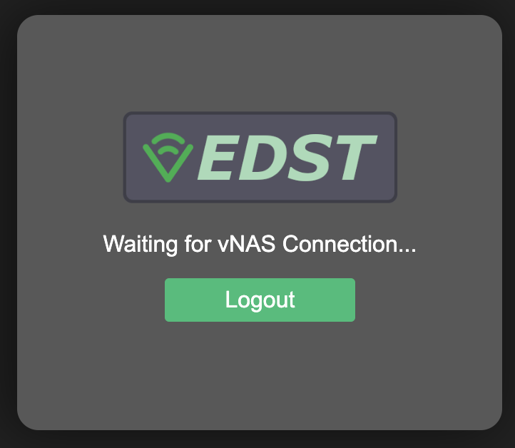
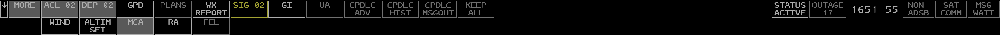
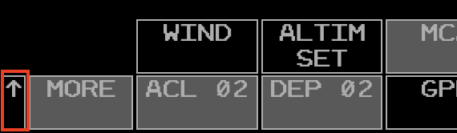
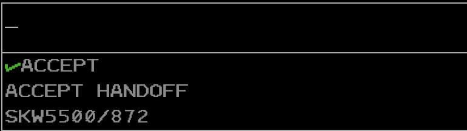
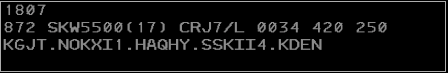
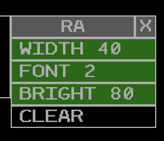
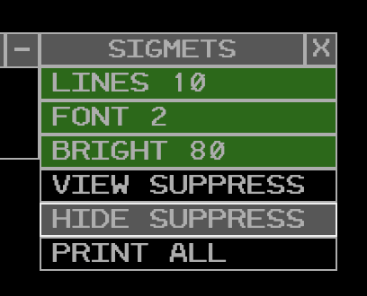

# vEDST User Manual
## Introduction

Virtual Enroute Decision Support Tool (vEDST) is a web application that simulates the Radar Assistant (D-Side) position interface used by real-world center controllers. vEDST is used in conjunction with other vNAS clients, such as CRC. This manual is intended to teach controllers how to utilize vEDST to supplement radar enroute control techniques while on the VATSIM network.

!!! note
    🔗 vEDST is accessed at [https://edst.vfds.dev/](https://edst.vfds.dev/)

!!! warning
    In order to interact with vEDST, your controlling session must be activated on your primary controlling client.

!!! note
    vEDST is currently in active development and not feature complete. The features that are currently implemented are described in this manual, and additional features will be added in the future.

## Setup
### Requirements
- A modern web browser (Google Chrome, Mozilla Firefox, Microsoft Edge, etc.)
- A browser window at least 1280x720 in size for optimal display
- A mouse with a middle button for specific clickable actions

### Logging in

Logging in to vEDST requires selecting an environment and authenticating through VATSIM Connect. Upon logging in to your VATSIM account and authorizing vNAS access, you are redirected back to the vEDST login page. vEDST then searches for your active position on a primary vNAS client, such as CRC.

<figure markdown="block" style="text-align: center;">
  
  <figcaption style="text-align: center; font-style: italic;">Fig 1. vEDST Login Screen</figcaption>
</figure>

If you are not logged in to a primary vNAS client, the message `Waiting for vNAS Connection...` is displayed:

<figure markdown="block" style="text-align: center;">
  
  <figcaption style="text-align: center; font-style: italic;">Fig 2. vEDST Waiting for vNAS Connection</figcaption>
</figure>

Once you are logged in to a primary vNAS client, the application will enter into the main vEDST interface.

<figure markdown="block" style="text-align: center;">
  
  <figcaption style="text-align: center; font-style: italic;">Fig 3. an EDST Display</figcaption>
</figure>

## Toolbar

<figure markdown="block" style="text-align: center;">
  
  <figcaption style="text-align: center; font-style: italic;">Fig 4. the EDST Toolbar</figcaption>
</figure>

The EDST position toolbar enables the user to display and suppress views and displays. It also provides:
- A current count of the number of flights in the Aircraft List and Departure List
- The current time in UTC

The toolbar can be raised/lowered between the top and bottom of the screen by clicking the raise/lower button

<figure markdown="block" style="text-align: center;">
  
  <figcaption style="text-align: center; font-style: italic;">Fig 5. the EDST Toolbar Raise/Lower Button highlighted in the lower position</figcaption>
</figure>

<!-- TODO: add mention of NOTAMS and GI buttons when they are implemented -->
Items in the toolbar that require a controller's attention are highlighted in yellow or red. For example:
- The SIGMETS (SIG) button is highlighted in yellow when there are unacknowledged entries in this view.
- The STATUS button is highlighted in yellow when you are not activated on a primary vNAS client (see [CRC Docs](https://crc.virtualnas.net/docs/#/?id=activating-and-deactivating-a-session) for instructions on activating a session in CRC).

## Views and Menus

### Repositioning Views
A view can be repositioned by left or middle-clicking its reposition pick area, as detailed in the individual view's documentation. When repositioning a view, an outline of the view is displayed and can be moved to the desired position using the mouse. Left or middle-clicking selects the new location. Pressing Esc cancels the reposition.

### Suppressing Views
Many views can be suppressed by left or middle-clicking the small square or x button on the view's title bar, as detailed in the individual view documentation.

!!! note
    The following information on the MCA and RA comes from the [CRC Documentation](https://crc.virtualnas.net/docs/#/eram?id=message-composition-area)
### Message Composition Area View
<figure markdown="block" style="text-align: center;">
  
  <figcaption style="text-align: center; font-style: italic;">Fig. 6 - The Message Composition Area</figcaption>
</figure>

The Message Composition Area (MCA) contains two text areas: the upper Preview Area where commands are entered, and the lower Feedback Area where command processing success and error messages are displayed.

Commands are typed directly into the MCA's Preview Area. Commands are executed by pressing `Enter`.

Some commands allow for logic check overrides which bypass certain command requirements, such as track ownership or handoff status. In most cases this is done by entering `/OK` before command parameters. For example, to amend a flight that is owned by another sector direct to a fix, the command `QU /OK ROBUC JBU123` could be entered. Note that logic check overrides do not override all logic checks. For example, flights owned by external ARTCCs cannot be edited, even with a logic check override included in the command.

!!! tip
    ⌨️ The left/right arrow keys move the cursor around the Preview Area.

<!-- TODO: implement these !!! tip
    ⌨️ `Ctrl` + `PgDn` and `Ctrl` + `PgUp` jumps the cursor to the end or the start of the Preview Area, respectively.

!!! tip
    ⌨️ `Ctrl` + `Enter` moves the cursor to the beginning of the next line in the Preview Area.

!!! tip
    ⌨️ `Ctrl + R` recalls the last command into the Preview Area. -->

!!! tip
    ⌨️ `Esc` clears the Preview and Feedback areas.

By default, the Preview Area is in overstrike mode (represented by an underscore cursor), meaning new characters overwrite the character at the cursor. The Preview Area can also be placed into insertion mode (represented by an underscore cursor with two additional vertical lines), meaning new characters are entered to the left of the cursor. Pressing `Insert` toggles between the two modes.

The MCA cannot be suppressed, but can be [repositioned](#repositioning-views) by left-clicking anywhere within its boundaries. Middle-clicking anywhere with the MCA's boundaries opens the MCA menu for configuring the MCA.

#### MCA View Menu

<figure markdown="block" style="text-align: center;">
  
  <figcaption style="text-align: center; font-style: italic;">Fig. 7 - The MCA Menu</figcaption>
</figure>

The MCA menu contains the following options:

- **PA LINES**: adjusts the maximum number of displayed Preview Area lines
- **WIDTH**: adjusts the number of characters on each line in the MCA
- **FONT**: adjusts the MCA's font size
- **BRIGHT**: adjusts the MCA's brightness

!!! tip
    🔗 For a full list of ERAM commands, please see the [Command Reference](#command-reference) section of the documentation.

### Response Area View
<figure markdown="block" style="text-align: center;">
  
  <figcaption style="text-align: center; font-style: italic;">Fig. 8 - The Response Area</figcaption>
</figure>

The Response Area (RA) displays text outputted by commands. For example, using the [`QF`](https://crc.virtualnas.net/docs/#/eram?id=qf-command) command outputs flight plan details in the RA (Figure 8).

If a command is entered in the [MCA](#message-composition-area-view) that outputs to the RA, but the RA is currently suppressed, the RA will be raised to the display.

The RA can be suppressed via the [Toolbar](#toolbar) and can be repositioned by left-clicking anywhere within its boundaries. Middle-clicking anywhere with the RA's boundaries opens the RA menu for configuring the RA.

#### RA View Menu

<figure markdown="block" style="text-align: center;">
  
  <figcaption style="text-align: center; font-style: italic;">Fig. 9 - The Response Area Menu</figcaption>
</figure

The RA menu contains the following options:

- **WIDTH**: adjusts the number of characters on each line in the RA
- **FONT**: adjusts the RA's font size
- **BRIGHT**: adjusts the RA's brightness
- **CLEAR**: clears the RA

### ACL View

### Departure List View

### SIGMETS View

<figure markdown="block" style="text-align: center;">
  
  <figcaption style="text-align: center; font-style: italic;">Fig. ?? - The SIGMETS View</figcaption>
</figure>

The SIGMETS view provides the user with SIGMET messages. The view may be accessed through the SIGMETS (`SIG`) toolbar button. The
view is also suppressed via the `SIG` toolbar button.

#### Notifications
When a new SIGMET entry is received, a notification is displayed in both the SIGMET view and the `SIG` toolbar button.

<figure markdown="block" style="text-align: center;">
  
  <figcaption style="text-align: center; font-style: italic;">Fig. ?? - SIGMET Toolbar Button with unread SIGMETs</figcaption>
</figure>

#### Acknowledging and Suppressing SIGMETs
Left-clicking a SIGMET entry marks the entry as "read" and allows the user to suppress the entry by clicking the "suppress" popout button. This will remove display of the entry if the `HIDE SUPPRESS` option is enabled in the menu.

<figure markdown="block" style="text-align: center;">
  
  <figcaption style="text-align: center; font-style: italic;">Fig. ?? - SIGMET Selected with Suppression Button</figcaption>
</figure>

##### SIGMETS View Menu

<figure markdown="block" style="text-align: center;">
  
  <figcaption style="text-align: center; font-style: italic;">Fig. ?? - The SIGMETS View Menu</figcaption>
</figure>

The SIGMETS view menu contains the following options:

- **LINES**: adjusts the maximum number of displayed SIGMET entries
- **FONT**: adjusts the SIGMETS view font size
- **BRIGHT**: adjusts the SIGMETS view brightness
- **VIEW SUPPRESS**: shows all SIGMET entries regardless of whether they have been marked as "suppressed."
- **HIDE SUPPRESS**: hides entries that have been marked as "suppressed."
- **PRINT ALL**: *not impelmented*

### Altimeter Settings View

### Status View

## Displays
### Graphic Plan Display
### Plans Display
### Wind Grid Display

### Hold Data Menu
### Route Menu
### Sort Menu
### Tools Menu
### Flight Plan Template Menu

## Command Reference
!!! note
    All ERAM commands that do **not** require clicking a position on the radar display are supported for entry on the EDST MCA. Please reference the [CRC ERAM Command Reference](https://crc.virtualnas.net/docs/#/eram?id=command-reference) for common ERAM/EDST Commands.

The following commands are specific to EDST UI functionality and do not work in CRC ERAM. These commands are typed into the [MCA](#message-composition-area-view) and executed by pressing `Enter`

| Command | Description | Supports `/OK`  | Supports multiple FLIDs |
| ------- | ----------- | --------------- | ----------------------- |
| `UU <enter>` | Displays/Raises the [ACL](#acl-view) |  |  |
| `UU D <enter>` | Displays/Raises the [DL](#departure-list-view) |  |  |
| `UU G <enter>` | Displays/Raises the [GPD](#graphic-plan-display) |  |  |
| `UU P <enter>` | Displays/Raises the [ACL](#acl-view) and toggles Manual Posting |  |  |
| `UU X <enter>` | All displayed and minimized views are hidden |  |  |
| `UU <sort criteria> <enter>` | Displays/Raises the [ACL](#acl-view) and changes the sort criteria |  |  |

The following are supported ACL sort criteria:

| Typed Character | Primary Criteria  | Secondary Criteria |
| --------------- | ----------------- | ------------------ |
| `OA`            | ACID              |                    |
| `OD`            | Destination       |                    |
| `OSA`           | Sector/Non-Sector | ACID               |
| `OSD`           | Sector/Non-Sector | Destination        |

## Known Issues
- Many view and display preferences are not currently saved between sessions. Support for saving these preferences will be added in the future.
