# vEDST User Manual
## Introduction

Virtual Enroute Decision Support Tool (vEDST) is a web application that simulates the Radar Assistant (D-Side) position interface used by real-world center controllers. vEDST is used in conjunction with other vNAS clients, such as CRC. This manual is intended to teach controllers how to utilize vEDST to supplement radar enroute control techniques while on the VATSIM network.

!!! note
    🔗 vEDST is accessed at [https://edst.vfds.dev/](https://edst.vfds.dev/)

!!! warning
    In order to interact with vEDST, your controlling session must be activated on your primary controlling client.

!!! note
    vEDST is currently in active development and not feature complete. The features that are currently implemented are described in this manual, and additional features will be added in the future.

## Setup
### Requirements
- A modern web browser (Google Chrome, Mozilla Firefox, Microsoft Edge, etc.)
- A browser window at least 1280x720 in size for optimal display
- A mouse with a middle button for specific clickable actions

### Logging in

Logging in to vEDST requires selecting an environment and authenticating through VATSIM Connect. Upon logging in to your VATSIM account and authorizing vNAS access, you are redirected back to the vEDST login page. vEDST then searches for your active position on a primary vNAS client, such as CRC.

<figure markdown="block" style="text-align: center;">
  
  <figcaption style="text-align: center; font-style: italic;">Fig 1. vEDST Login Screen</figcaption>
</figure>

If you are not logged in to a primary vNAS client, the message `Waiting for vNAS Connection...` is displayed:

<figure markdown="block" style="text-align: center;">
  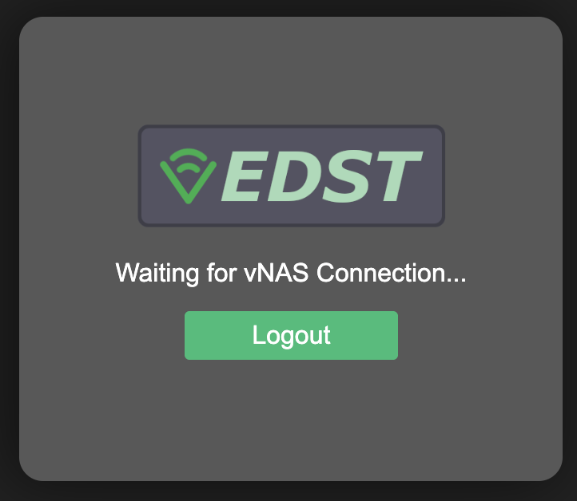
  <figcaption style="text-align: center; font-style: italic;">Fig 2. vEDST Waiting for vNAS Connection</figcaption>
</figure>

Once you are logged in to a primary vNAS client, the application will enter into the main vEDST interface.

<figure markdown="block" style="text-align: center;">
  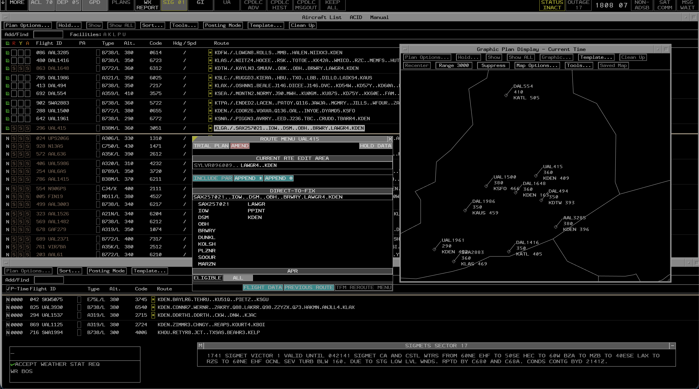
  <figcaption style="text-align: center; font-style: italic;">Fig 3. an EDST Display</figcaption>
</figure>

## Toolbar

<figure markdown="block" style="text-align: center;">
  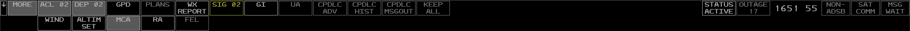
  <figcaption style="text-align: center; font-style: italic;">Fig 4. the EDST Toolbar</figcaption>
</figure>

The EDST position toolbar enables the user to display and suppress views and displays. It also provides:
- A current count of the number of flights in the Aircraft List and Departure List
- The current time in UTC

The toolbar can be raised/lowered between the top and bottom of the screen by clicking the raise/lower button

<figure markdown="block" style="text-align: center;">
  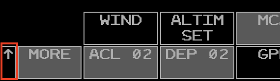
  <figcaption style="text-align: center; font-style: italic;">Fig 5. the EDST Toolbar Raise/Lower Button highlighted in the lower position</figcaption>
</figure>

<!-- TODO: add mention of NOTAMS and GI buttons when they are implemented -->
Items in the toolbar that require a controller's attention are highlighted in yellow or red. For example:
- The SIGMETS (SIG) button is highlighted in yellow when there are unacknowledged entries in this view.
- The STATUS button is highlighted in yellow when you are not activated on a primary vNAS client (see [CRC Docs](https://crc.virtualnas.net/docs/#/?id=activating-and-deactivating-a-session) for instructions on activating a session in CRC).

## Views

### Repositioning Views
A view can be repositioned by left or middle-clicking its reposition pick area, as detailed in the individual view's documentation. When repositioning a view, an outline of the view is displayed and can be moved to the desired position using the mouse. Left or middle-clicking selects the new location. Pressing Esc cancels the reposition.

### Suppressing Views
Many views can be suppressed by left or middle-clicking the small square or x button on the view's title bar, as detailed in the individual view documentation.

!!! note
    The following information on the MCA and RA comes from the [CRC Documentation](https://crc.virtualnas.net/docs/#/eram?id=message-composition-area)
### Message Composition Area View
<figure markdown="block" style="text-align: center;">
  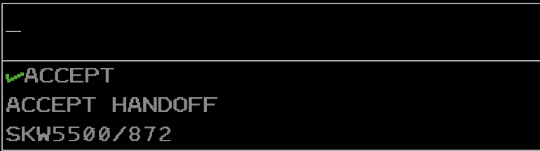
  <figcaption style="text-align: center; font-style: italic;">Fig. 6 - The Message Composition Area</figcaption>
</figure>

The Message Composition Area (MCA) contains two text areas: the upper Preview Area where commands are entered, and the lower Feedback Area where command processing success and error messages are displayed.

Commands are typed directly into the MCA's Preview Area. Commands are executed by pressing `Enter`.

Some commands allow for logic check overrides which bypass certain command requirements, such as track ownership or handoff status. In most cases this is done by entering `/OK` before command parameters. For example, to amend a flight that is owned by another sector direct to a fix, the command `QU /OK ROBUC JBU123` could be entered. Note that logic check overrides do not override all logic checks. For example, flights owned by external ARTCCs cannot be edited, even with a logic check override included in the command.

!!! tip
    ⌨️ The left/right arrow keys move the cursor around the Preview Area.

<!-- TODO: implement these !!! tip
    ⌨️ `Ctrl` + `PgDn` and `Ctrl` + `PgUp` jumps the cursor to the end or the start of the Preview Area, respectively.

!!! tip
    ⌨️ `Ctrl` + `Enter` moves the cursor to the beginning of the next line in the Preview Area.

!!! tip
    ⌨️ `Ctrl + R` recalls the last command into the Preview Area. -->

!!! tip
    ⌨️ `Esc` clears the Preview and Feedback areas.

By default, the Preview Area is in overstrike mode (represented by an underscore cursor), meaning new characters overwrite the character at the cursor. The Preview Area can also be placed into insertion mode (represented by an underscore cursor with two additional vertical lines), meaning new characters are entered to the left of the cursor. Pressing `Insert` toggles between the two modes.

The MCA cannot be suppressed, but can be [repositioned](#repositioning-views) by left-clicking anywhere within its boundaries. Middle-clicking anywhere with the MCA's boundaries opens the MCA menu for configuring the MCA.

#### MCA View Menu

<figure markdown="block" style="text-align: center;">
  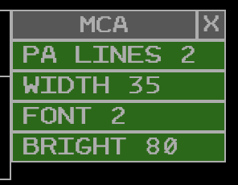
  <figcaption style="text-align: center; font-style: italic;">Fig. 7 - The MCA Menu</figcaption>
</figure>

The MCA menu contains the following options:

- **PA LINES**: adjusts the maximum number of displayed Preview Area lines
- **WIDTH**: adjusts the number of characters on each line in the MCA
- **FONT**: adjusts the MCA's font size
- **BRIGHT**: adjusts the MCA's brightness

!!! tip
    🔗 For a full list of ERAM commands, please see the [Command Reference](#command-reference) section of the documentation.

### Response Area View
<figure markdown="block" style="text-align: center;">
  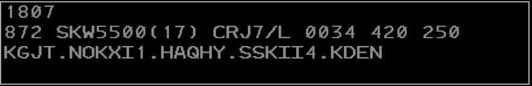
  <figcaption style="text-align: center; font-style: italic;">Fig. 8 - The Response Area</figcaption>
</figure>

The Response Area (RA) displays text outputted by commands. For example, using the [`QF`](https://crc.virtualnas.net/docs/#/eram?id=qf-command) command outputs flight plan details in the RA (Figure 8).

If a command is entered in the [MCA](#message-composition-area-view) that outputs to the RA, but the RA is currently suppressed, the RA will be raised to the display.

The RA can be suppressed via the [Toolbar](#toolbar) and can be repositioned by left-clicking anywhere within its boundaries. Middle-clicking anywhere with the RA's boundaries opens the RA menu for configuring the RA.

#### RA View Menu

<figure markdown="block" style="text-align: center;">
  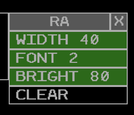
  <figcaption style="text-align: center; font-style: italic;">Fig. 9 - The Response Area Menu</figcaption>
</figure>

The RA menu contains the following options:

- **WIDTH**: adjusts the number of characters on each line in the RA
- **FONT**: adjusts the RA's font size
- **BRIGHT**: adjusts the RA's brightness
- **CLEAR**: clears the RA

### ACL View

<figure markdown="block" style="text-align: center;">
  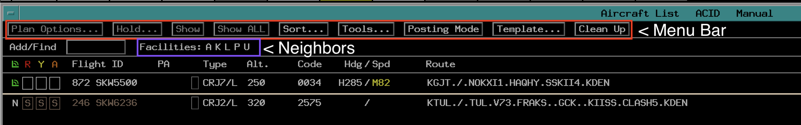
  <figcaption style="text-align: center; font-style: italic;">Fig. 10 - The ACL View</figcaption>
</figure>

The ACL or Aircraft List view provides the user with a list of all flights that are currently airborne and predicted to pass through the controller's sector. The view may be accessed through the ACL toolbar button. The view is also suppressed via the ACL toolbar button.

!!! note
    As airspace awareness is not yet implemented on the controller side, expect to see all flights within the ARTCC ADS-B AOI. This may include flights that are not actually predicted to pass through the controller's sector.

#### Header Bar
<figure markdown="block" style="text-align: center;">
  
  <figcaption style="text-align: center; font-style: italic;">Fig. 11 - The ACL Header Bar</figcaption>
</figure>

The ACL view contains a header bar with the following information and buttons:
- The view title "Aircraft List"
- The primary sort criteria for the list (see [ACL Sort Criteria](#acl-sort-criteria))
- The posting mode

The small square button on the right of the header bar suppresses the ACL view when clicked.

The large square button on the right of the header bar toggles fullscreen/windowed mode. By default the ACL view is in fullscreen mode.

#### Menu Bar

The ACL menu bar contains a series of buttons for interacting with the ACL view and the flights contained within it. Not all buttons are available at all times, and this is indicated by the button being grayed out and unclickable. For example the `Plan Options` and `Hold` buttons are only clickable when a flight is selected in the ACL.

The buttons are as follows:

- **Plan Options**: opens the [Plan Options](#plan-options-menu) menu for the selected flight
- **Hold**: opens the [Hold](#hold-data-menu) menu for the selected flight
- **Show**: displays or removes the selected flight from the [Graphic Plan Display](#graphic-plan-display)
- **Show All**: displays or removes the selected flight and all alerts assigned to the flight from the [Graphic Plan Display](#graphic-plan-display)
- **Sort**: opens the [Sort](#acl-sort-criteria) menu to change the ACL sort criteria
- **Tools**: opens the [Tools](#toolsoptions-menus) menu for various ACL options
- **Posting Mode**: toggles the ACL posting mode between Manual and Automatic.
- **Template**: opens the [Flight Plan Template](#flight-plan-template-menu) menu.
- **Clean Up**: removes all flights coded gray for deletion

#### Posting Mode

Posting mode governs the order in which flights are displayed in the ACL. The posting mode options are **Automatic** and **Manual**.

In Automatic mode, all flights are placed in the *normal* posting area of the ACL and are sorted according to the current sort criteria. 

In Manual mode, all flights are placed in the *manual* posting area of the ACL in the time in which they were added to the ACL. The manual posting area is indicated by a horizontal dividing line in the ACL.

#### ACL Sort Criteria

<figure markdown="block" style="text-align: center;">
  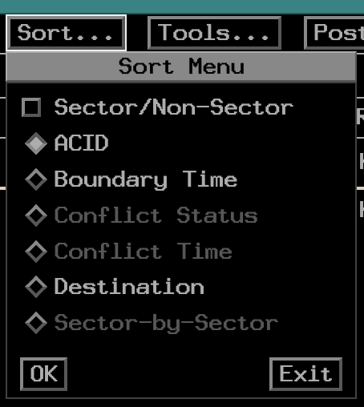
  <figcaption style="text-align: center; font-style: italic;">Fig. 12 - The Sort Criteria Menu</figcaption>
</figure>

The ACL can be sorted by the following criteria:

1. Aircraft ID: Alphabetic order based on the ACID.
2. Boundary Time: Time estimated to cross the sector boundary, soonest at the top of the list.
3. Conflict Status: Red, then Yellow, then Aispace Alerts. All non-alert status aircraft are sorted at the bottom of the list.
4. Conflict Time: Sorted by alert time, the aircraft with the soonest alert at the top.
5. Destination: Aircraft are sorted alphabetically according to filed destination.
6. Sector-by-Sector: Sorted by aircraft under your ownership, then alphanumerically by sector ID.

!!! tip
    The ACL sort criteria can also be changed by entering `UU <sort criteria>` in the [MCA](#message-composition-area-view) and pressing `Enter`. For a full reference of supported MCA commands, please see the [Command Reference](#command-reference) section of the documentation.

!!! note
    The `Conflict Status`, `Conflict Time`, and `Sector-by-Sector` sort criteria are not yet fully implemented as the underlying alert and ownership data is not yet fully implemented.

#### Neighboring Facilities
<figure markdown="block" style="text-align: center;">
  
  <figcaption style="text-align: center; font-style: italic;">Fig. 13 - The Neighboring Facilities Display</figcaption>
</figure>

Below the menu bar buttons are a list of the neighboring ARTCC facilities. These are represented by their single letter handoff codes. Faciltiies not online are grey, while facilities that are online are white. 

#### Tools/Options Menus
<figure markdown="block" style="text-align: center;">
  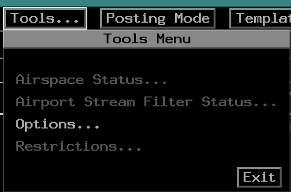
  <figcaption style="text-align: center; font-style: italic;">Fig. 14 - The Tools Menu</figcaption>
</figure>
<figure markdown="block" style="text-align: center;">
  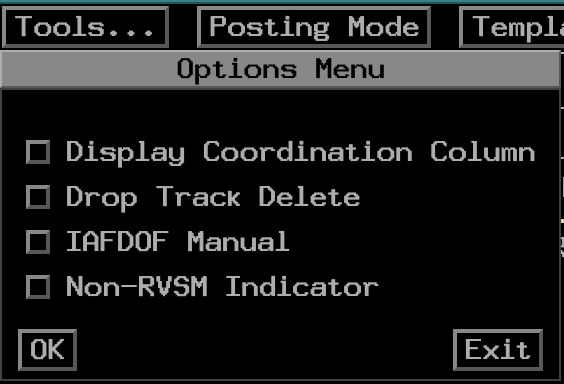
  <figcaption style="text-align: center; font-style: italic;">Fig. 15 - The Options Menu</figcaption>
</figure>

The only implemented option of the tools menu is to access the options menu.

The options menu contains the following options:

- Display Coordination Column - displays or suppresses the coordination (P) column in the ACL
- Track Delete Option - specifies if tracks should be deleted immediately when a radar track is dropped, or wait until the entry has timed out
- IAFDOF Manual - disables automatic IAFDOF coloring for flights in the ACL, allowing the user to middle click on ACIDs to cycle through IAFDOF colors manually.
- Non–RVSM Indicator - Enables/Disables display of the non-rvsm indicator (coral box) to the right of the altitude when a flight is not equipped for RVSM flight.

#### Columns
<figure markdown="block" style="text-align: center;">
  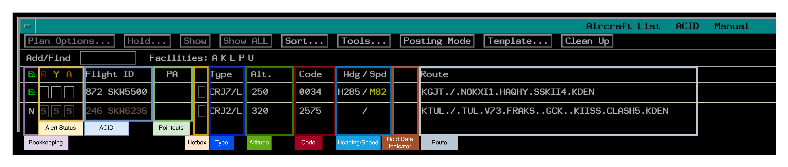
  <figcaption style="text-align: center; font-style: italic;">Fig. 16 - ACL Columns</figcaption>
</figure>

Some columns can be contracted or expanded by clicking the column title. If a column contains information that is not currently visible due to the column being contracted, a "*" is displayed in the respective field.

##### Bookkeeping Column
The bookkeeping column tracks wether aircraft in the ACL are on your frequency or not.

**New Entries:** are represented by a grey "N". In the normal posting area, left clicking removes the "N". Middle clicking moved the flight to the special attention area. In manual posting mode, left clicking the "N" both removes it and moved the flight to the normal posting area.

**Blank Area:** A blank area indicates that you have acknowledged or interacted with the flight.

**Manual On-Frequency:** is represented by the green corner with two arcs. This indicator can be toggled on using the `// <ACID>` command in the [MCA](#message-composition-area-view), or by left clicking the blank area in the bookkeeping column.

**Shaded Grey Box:** indicates that the flight has been kept by the user

##### Alert Column
Proper conflict processing is not yet implemented. At this time flights that are tracked by you will have white boxes, and flights not tracked by you will have a brown S indicating that a "stop probe" is in place for the flight.

##### Flight ID Column
<figure markdown="block" style="text-align: center;">
  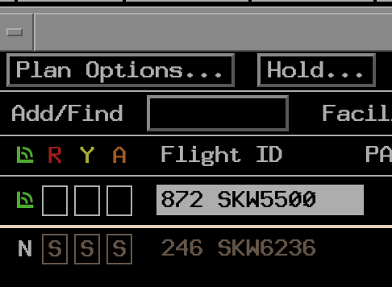
  <figcaption style="text-align: center; font-style: italic;">Fig. 17 - ACL Flight ID Highlight</figcaption>
</figure>
The flight ID column contains both the aircraft callsign and CID. Selecting a flight by left-clicking anywhere on the flight ID highlights the flight ID. Interaction with menu buttons is now in reference to this specific flight.

<!-- ##### Pointouts Column -->

##### Hotbox
Left clicking the hotbox opens and closes a free-form typing area.
<figure markdown="block" style="text-align: center;">
  
  <figcaption style="text-align: center; font-style: italic;">Fig. 18 - Hotbox Typing Area</figcaption>
</figure>

!!!note
    Text inserted into the hotbox is not saved on the server and will not transfer to other controllers. For that, you must use the 4th line free text.

Right clicking the hotbox moves/removes the special indication color.
<figure markdown="block" style="text-align: center;">
  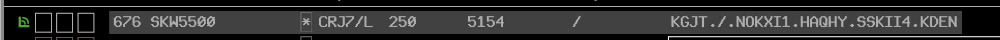
  <figcaption style="text-align: center; font-style: italic;">Fig. 19 - Hotbox Special Posting Indication</figcaption>
</figure>

##### Type Column
The type column displays the aircraft type and FAA equipment code. Selecting this field results in the same behavior as selecting the flight ID.

##### Altitude Column
The altitude field includes the flight plan altitude, including:

- Assigned Altitude
- Block Altitude
- Interm Altitude
- Procedure Altitude
- Non-RVSM Indicator
- IAFDOF Indicator

Left clicking on the altitude opens the altitude menu.
<figure markdown="block" style="text-align: center;">
  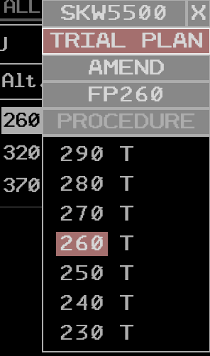
  <figcaption style="text-align: center; font-style: italic;">Fig. 20 - ACL Altitude Menu</figcaption>
</figure>

The menu defaults to a *trial* amendment. If you select an altitude in this mode it will open a new *Trial Plan* in the [Plans Display](#plans-display).

Alternative if you wish to simply amend the aircraft's altitude without opening a trial plan, you can click the `Amend` button to switch to *amend* mode. In this mode, selecting an altitude will immediately send an altitude amendment.

##### Beacon Code Column
The code column displays the flight's assigned beacon code. Selecting this field results in the same behavior as selecting the flight ID.

##### Heading/Speed Column
The heading/speed column displays the assigned 4th line heading/speed. Additionally, a local "scratchpad" is available for heading and speed that is not transmitted to the R-side 4th line.
<figure markdown="block" style="text-align: center; max-width: 50%; center;">
  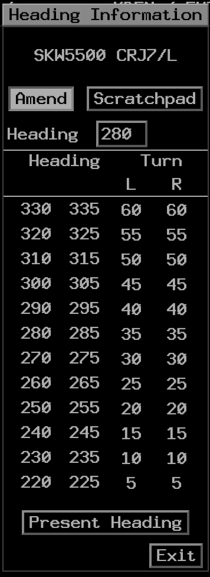
  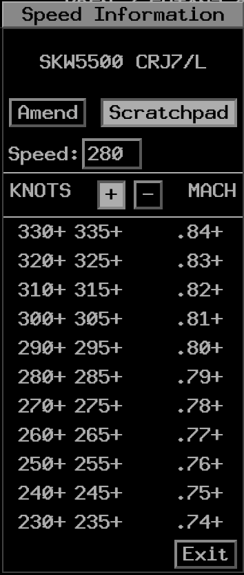
  <figcaption style="text-align: center; font-style: italic;">Fig. 21 - ACL Heading and Speed Menus</figcaption>
</figure>

Left clicking on headings or speeds in the *amend* mode sends the respective `QS` command. Selecting a heading or speed in the *scratchpad* mode adds the respective heading or speed in yellow.

Speeds "or greater" and "or less" can be entered by left-clicking the plus or minus symbol before left-clicking the speed. This adds the respective symbol to the speed in the scratchpad.

##### Route Column
The route column displays the flight's currently filed route, including any amendments. Left clicking the route opens the [route menu](#route-menu) for the flight.

If the filed flight plan contains remarks, a yellow `*` is displayed next to the route. Left clicking the `*` toggles between displaying the remarks and the route in the route column.

### Departure List View
<figure markdown="block" style="text-align: center;">
  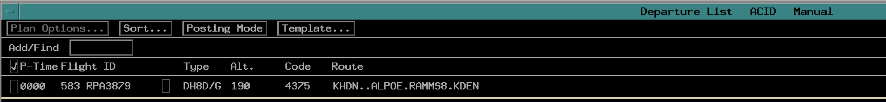
  <figcaption style="text-align: center; font-style: italic;">Fig. 22 - The Departure List</figcaption>
</figure>
The Departure List view provides the user with a list of all flights that are currently on the ground and predicted to depart into the controller's sector. The view may be accessed through the `DEP` toolbar button. The view is also suppressed via the `DEP` toolbar button.

!!! note
    As airspace awareness is not yet implemented on the controller side, expect to see all flights within the ARTCC ADS-B AOI. This may include flights that are not actually predicted to depart into the controller's sector.

#### Header Bar
The Departure List view contains a header bar with the following information and buttons:

- The view title "Departure List"
- The primary sort criteria for the list (see [Departure List Sort Criteria](#dl-sort-criteria))
- The posting mode

The small square button on the right of the header bar suppresses the DL view when clicked.

The large square button on the right of the header bar toggles fullscreen/windowed mode. By default the DL view is in fullscreen mode.

#### Menu Bar

The DL menu bar contains a series of buttons for interacting with the DL view and the flights contained within it. Not all buttons are available at all times, and this is indicated by the button being grayed out and unclickable. For example the `Plan Options` button is only clickable when a flight is selected in the DL.

The buttons are as follows:

- **Plan Options**: opens the [Plan Options](#plan-options-menu) menu for the selected flight
- **Sort**: opens the [Sort](#dl-sort-criteria) menu to change the DL sort criteria
- **Posting Mode**: toggles the DL posting mode between Manual and Automatic.
- **Template**: opens the [Flight Plan Template](#flight-plan-template-menu) menu.

#### Posting Mode

Posting mode governs the order in which flights are displayed in the DL. The posting mode options are **Automatic** and **Manual**.

In Automatic mode, all flights are placed in the *normal* posting area of the DL and are sorted according to the current sort criteria.

In Manual mode, all flights are placed in the *manual* posting area of the DL in the time in which they were added to the DL. The manual posting area is indicated by a horizontal dividing line in the DL.

#### DL Sort Criteria

<figure markdown="block" style="text-align: center;">
  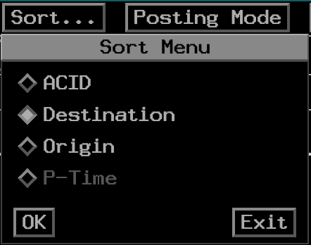
  <figcaption style="text-align: center; font-style: italic;">Fig. 23 - The DL Sort Criteria Menu</figcaption>
</figure>

The DL can be sorted by the following criteria:

1. Aircraft ID: Alphabetic order based on the ACID.
2. Destination: Aircraft are sorted alphabetically according to filed destination.
3. Origin: Aircraft are sorted alphabetically according to filed origin.
4. P-Time: Filed estimated departure time, soonest at the top of the list.

!!! note
    The `P-Time` sort criteria is not yet fully implemented as the underlying flight data is not yet fully implemented.

#### Columns
The columns in the DL are:

- Bookkeeping
- Planned Departure Time (P Time)
- Flight ID
- Type (Aircraft Type and Equipment Code)
- Altitude (Filed Cruise Altitude)
- Beacon Code
- Route

##### Bookkeeping Column
The bookkeeping column tracks whether aircraft in the DL have been acknowledged by the controller. Each new entry is represented by a grey "N". Left clicking the "N" changes it to a blank area, indicating that you have acknowledged the flight. Clicking again changes the blank area to a check mark. This can be used to track whether you have issued the departure clearance for the flight. This information is not saved on the server and will not transfer to other controllers.

##### Flight ID Column
The flight ID column contains both the aircraft callsign and CID. Selecting a flight by left-clicking anywhere on the flight ID highlights the flight ID. Interaction with menu buttons is now in reference to this specific flight.

##### DL Hotbox
The DL hotbox functions the same as the [ACL hotbox](#hotbox) and is used for free-form typing and special posting indication in the DL.

##### Type Column
The type column displays the aircraft type and FAA equipment code. Selecting this field results in the same behavior as selecting the flight ID.

##### Altitude Column
<figure markdown="block" style="text-align: center;">
  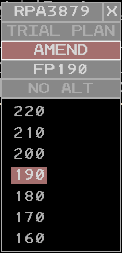
  <figcaption style="text-align: center; font-style: italic;">Fig. 24 - DL Altitude Menu</figcaption>
</figure>
The altitude field includes the planned cruise altitude. Left clicking on the altitude opens the altitude menu, which only allows for ammendments and not trial plans. Selecting an altitude in this menu sends an immediate altitude amendment.

##### Beacon Code Column
The code column displays the flight's assigned beacon code. Selecting this field results in the same behavior as selecting the flight ID.

##### Route Column
The route column displays the flight's currently filed route, including any amendments. Left clicking the route opens the [route menu](#route-menu) for the flight.

### SIGMETS View

<figure markdown="block" style="text-align: center;">
  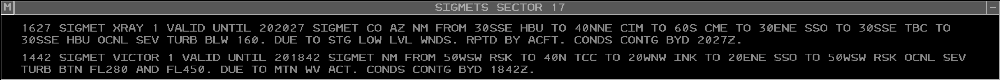
  <figcaption style="text-align: center; font-style: italic;">Fig. 25 - The SIGMETS View</figcaption>
</figure>

The SIGMETS view provides the user with SIGMETs that are active within 150nm of their controlling ARTCC. The view may be accessed through the SIGMETS (`SIG`) toolbar button. The
view is also suppressed via the `SIG` toolbar button.

#### Notifications
When a new SIGMET entry is received, a notification is displayed in both the SIGMET view and the `SIG` toolbar button.

<figure markdown="block" style="text-align: center;">
  
  <figcaption style="text-align: center; font-style: italic;">Fig. 26 - SIGMET Toolbar Button with unread SIGMETs</figcaption>
</figure>

#### Acknowledging and Suppressing SIGMETs
Left-clicking a SIGMET entry marks the entry as "read" and allows the user to suppress the entry by clicking the "suppress" popout button. This will remove display of the entry if the `HIDE SUPPRESS` option is enabled in the menu.

<figure markdown="block" style="text-align: center;">
  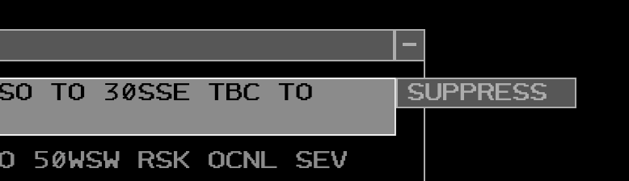
  <figcaption style="text-align: center; font-style: italic;">Fig. 27 - SIGMET Selected with Suppression Button</figcaption>
</figure>

#### SIGMETS View Menu

<figure markdown="block" style="text-align: center;">
  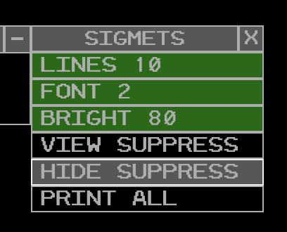
  <figcaption style="text-align: center; font-style: italic;">Fig. 28 - The SIGMETS View Menu</figcaption>
</figure>

The SIGMETS view menu contains the following options:

- **LINES**: adjusts the maximum number of displayed SIGMET entries
- **FONT**: adjusts the SIGMETS view font size
- **BRIGHT**: adjusts the SIGMETS view brightness
- **VIEW SUPPRESS**: shows all SIGMET entries regardless of whether they have been marked as "suppressed."
- **HIDE SUPPRESS**: hides entries that have been marked as "suppressed."
- **PRINT ALL**: *not impelmented*

### Altimeter Settings View
<figure markdown="block" style="text-align: center;">
  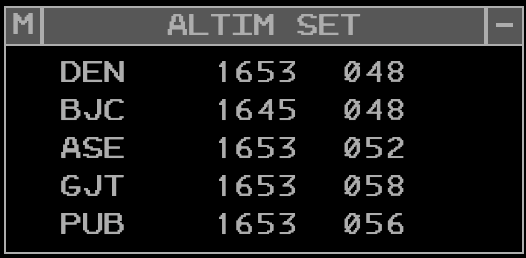
  <figcaption style="text-align: center; font-style: italic;">Fig. 29 - The Altimeter Settings View</figcaption>
</figure>

The altimeter settings view provides the user with a list of current altimeter settings for a selectable list of airports. The view may be accessed through the `ALTIM SET` toolbar button in the `MORE` section. The view is also suppressed via the `ALTIM SET` toolbar button.

#### Adding/Removing Stations

To add or remove a station from the altimeter settings view, enter `QD <station>` in the [MCA](#message-composition-area-view) and press `Enter`. Valid stations are FAA 3-letter identifiers. 

Clicking on a station in the list exposes a deletion option. Clicking the delete button removes the station from the list.
<figure markdown="block" style="text-align: center;">
  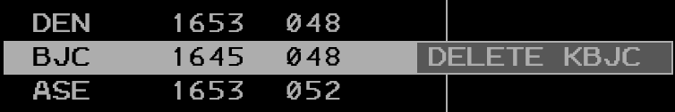
  <figcaption style="text-align: center; font-style: italic;">Fig. 30 - The Altimeter Settings Delete Option</figcaption>
</figure>

#### Altimeter Settings View Menu
<figure markdown="block" style="text-align: center;">
  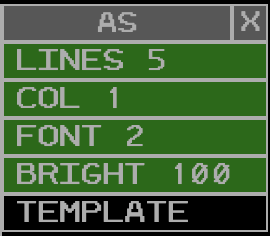
  <figcaption style="text-align: center; font-style: italic;">Fig. 31 - The Altimeter Settings View Menu</figcaption>
</figure>

The altimeter settings view menu contains the following options:

- **LINES**: adjusts the maximum number of displayed stations
- **COL**: adjusts the number of columns in which stations are displayed
- **FONT**: adjusts the altimeter settings view font size
- **BRIGHT**: adjusts the altimeter settings view brightness
- **TEMPLATE**: *not implemented*

### Weather Station Report View

<figure markdown="block" style="text-align: center;">
  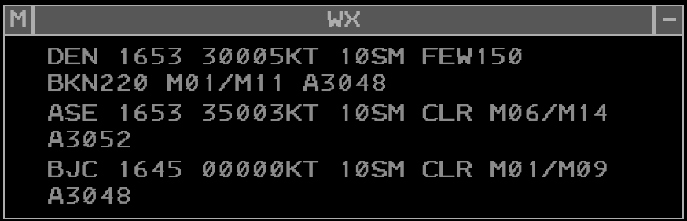
  <figcaption style="text-align: center; font-style: italic;">Fig. 32 - The Weather Station Report View</figcaption>
</figure>
The weather station report view provides the user with a list of current weather reports (METARs) for a selectable list of stations. The view may be accessed through the `WX REPORT` toolbar button. The view is also suppressed via the `WX REPORT` toolbar button.

#### Adding/Removing Stations

To add or remove a station from the weather station report view, enter `WR <station>` in the [MCA](#message-composition-area-view) and press `Enter`. Valid stations are FAA 3-letter identifiers.

Clicking on a station in the list exposes a deletion option. Clicking the delete button removes the station from the list.
<figure markdown="block" style="text-align: center;">
  
  <figcaption style="text-align: center; font-style: italic;">Fig. 33 - The Weather Station Report View Delete Option</figcaption>
</figure>

#### Weather Station Report View Menu

<figure markdown="block" style="text-align: center;">
  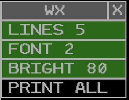
  <figcaption style="text-align: center; font-style: italic;">Fig. 34 - The Weather Station Report View Menu</figcaption>
</figure> 

The weather station report view menu contains the following options:

- **LINES**: adjusts the maximum number of displayed stations
- **FONT**: adjusts the weather station report view font size
- **BRIGHT**: adjusts the weather station report view brightness
- **PRINT ALL**: *not implemented*

### Status View
<figure markdown="block" style="text-align: center;">
  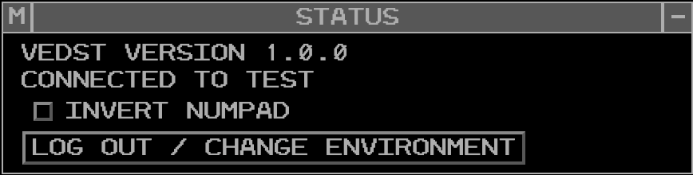
  <figcaption style="text-align: center; font-style: italic;">Fig. 35 - The Status View</figcaption>
</figure> 
The status view provides the user with information about the vEDST application and their current session. The view may be accessed through the `STATUS` toolbar button. The view is also suppressed via the `STATUS` toolbar button.

The view displays the current version of the vEDST application.

The view displays the vNAS server that the user is currently connected to.

The view contains an "invert numpad" option that inverts the numeric keypad when sending datablock positioning commands from the [MCA](#message-composition-area-view).

The view contains a "Log Out/Change Environment" button that logs the user out of their current session and returns them to the [login screen](#logging-in).

## Menus
The following sections are menus that can be accessed through multiple views and displays.

### Hold Data Menu
<figure markdown="block" style="text-align: center;">
  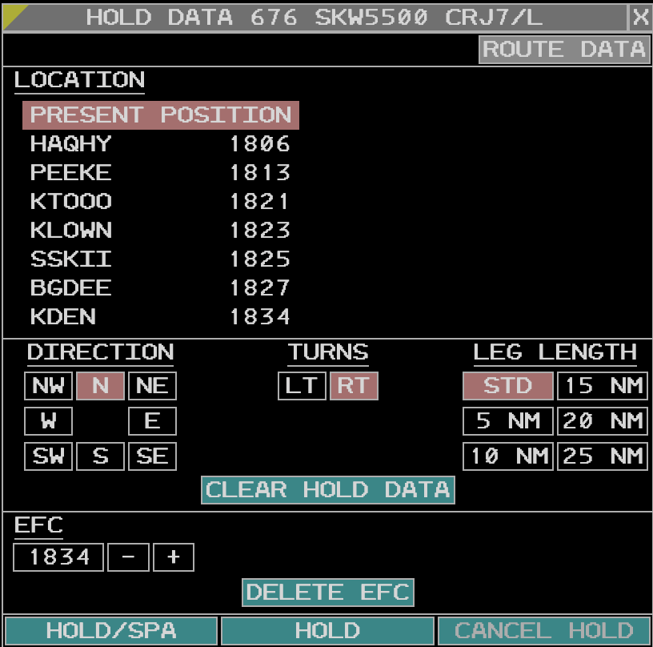
  <figcaption style="text-align: center; font-style: italic;">Fig. 36 - The Hold Data Menu</figcaption>
</figure> 

The hold data menu is used to input, amend, and cancel holding information for airborne flights. The menu can be accessed by selecting a flight in the [ACL](#acl-view) and clicking the `Hold` button in the ACL menu bar, or by selecting the aircraft in the GPD and clicking the `Hold` button in the GPD menu bar.

The hold menu header contains the flight ID and type. Below that is a "Route Data" button which will open the route menu for the respective flight.

#### Location Section
The location section contains all possible holding waypoints and their time estimates. The selected holding location is indicated by a red highlight.

#### Hold Parameters Section
The hold parameters section contains the following parameters for the hold:
- **Direction**: the cardinal direction of the hold in relation to the holding fix.
- **Turn**: the direction of turns in the hold, either left or right.
- **Leg Length**: the length of hold legs, in nautical miles.

#### EFC Section
The EFC (Expect Further Clearance) section contains the expected further clearance time for the hold. It defaults to 30 minutes after the predicted time of arrival at the holding fix, but can be adjusted as needed using the plus and minus buttons. Below the EFC input is the "Delete EFC" button, which deletes the EFC time when clicked.

#### Submit and Cancel Buttons
The "Hold/SPA" button submits the hold information entered in the menu and immediately moves the flight to the special posting area of the ACL. The "Hold" button submits the hold information without moving the flight to the special posting area. The "Cancel Hold" button cancels the hold and removes all hold information from the flight. If the cancel hold button is clicked before the EFC time, a warning dialog is displayed to confirm that the user intends to cancel the hold early.

<figure markdown="block" style="text-align: center;">
  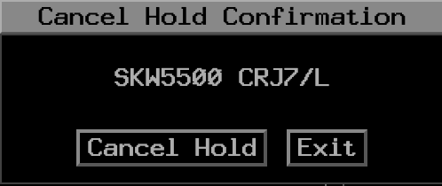
  <figcaption style="text-align: center; font-style: italic;">Fig. 37 - Cancel Hold Dialog</figcaption>
</figure> 

#### Hold Data Display
When a hold is active for a flight, the hold parameters are displayed in the route column of the ACL when the "H" in the hold column has been left clicked.
<figure markdown="block" style="text-align: center;">
  
  <figcaption style="text-align: center; font-style: italic;">Fig. 38 - Hold Line Display</figcaption>
</figure> 

### Route Menu
<figure markdown="block" style="text-align: center;">
  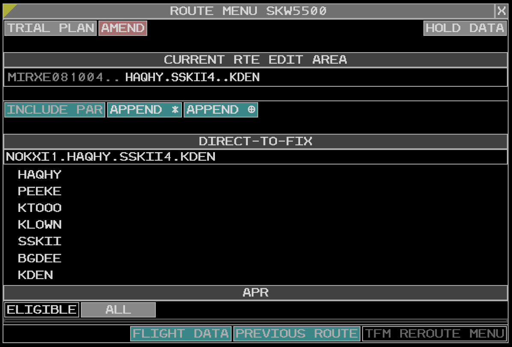
  <figcaption style="text-align: center; font-style: italic;">Fig. 39 - The Route Menu</figcaption>
</figure>

The route menu is used to view and amend a flight's route. The menu can be accessed by selecting a flight in the [ACL](#acl-view) or [DL](#departure-list-view) and clicking the `Route` button in the `Plan Options` menu, or by left clicking the route field in the ACL or DL.

The route menu header contains the flight ID. Below that are the "Trial Plan" and "Amend" buttons. When the trial plan option is selected, changes to the route opens a new trial plan in the [Plans Display](#plans-display). The amend button sends an immediate route amendment based on the current route in the menu.

When invoking the route menu from the ACL, the "Trial Plan" is selected by default. When invoking the route menu from the DL, the "Amend" option is selected by default and the trial plan is unavailable.

Additionally, a "Hold Data" button is available in the route menu header that opens the [Hold Data Menu](#hold-data-menu) for the respective flight.

#### Current Route Edit Area
The raw route is displayed in the current route edit area. This is a text input box that allows for free-form editing of the route. Once you are done editing the route pressing the `Enter` key sends the route amendment. If the trial plan option is selected, pressing `Enter` opens a new trial plan in the [Plans Display](#plans-display) with the amended route.

#### Route Menu Selection Buttons
Below the route edit area are buttons for modifying the route amendment and display. They are:

- **Include Preferred Arrival Route (PAR)** - *Not Implemented*
- **Append `*`** - prohibits the application of an adapted route
- **Append `.`** - inhibits Equipment Restricted Routes (ERR) application

#### Direct-to-fix Section
The top of the direct-to-fix section displays the ATC intended route. Below that is a list of possible fixes that the aircraft can be sent direct to. Left clicking a fix sends a direct-to amendment to the selected fix. If the trial plan option is selected, this opens a new trial plan in the [Plans Display](#plans-display) with the direct-to amendment.

#### APR (Adapted Preferred Route) Section
The APR section displays the any available preferred routes for the flight based on route, airport configuration, aircraft type, and adapted parameters.

#### Access to Other Route Menus Area
*These buttons are not implemented at this time*

### Plan Options Menu
<figure markdown="block" style="text-align: center;">
  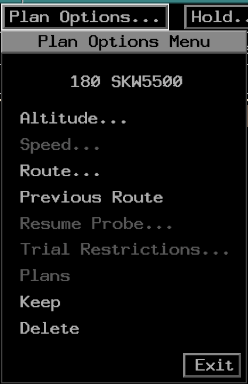
  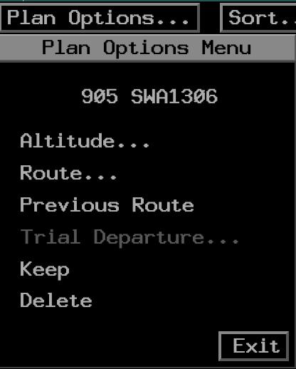
  <figcaption style="text-align: center; font-style: italic;">Fig. 40 - ACL and DL Plan Options Menus</figcaption>
</figure>

The plan options menu is used to access various options related to a flight's plan. The menu can be accessed by selecting a flight in the [ACL](#acl-view) or [DL](#departure-list-view) and clicking the `Plan Options` button in the respective menu bar.

The common options between the ACL and DL plan options menus are as follows:

- **Altitude** - opens the altitude menu for the flight
- **Route** - opens the [route menu](#route-menu) for the flight
- **Previous Route** - *not implemented*
- **Keep** - toggles whether the flight is coded for deletion or kept in the ACL/DL
- **Delete** - deletes the flight from the ACL/DL

### Flight Plan Template Menu
<figure markdown="block" style="text-align: center;">
  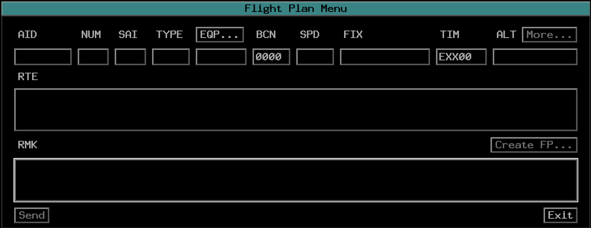
  <figcaption style="text-align: center; font-style: italic;">Fig. 41 - The Flight Plan Template Menu</figcaption>
</figure>

The flight plan template provides a convenient way for the user to create `FP` messages for creating or amending existing flight plans. All fields in an ICAO flight plan are represented in the template menu, and specific navigational equipment fields are editable by clicking the `EQP` button.

!!! note
    The flight plan template is not yet fully implemented. At this time, it is not possible to submit flight plans created in the template menu.

## Displays

### Graphic Plan Display
<figure markdown="block" style="text-align: center;">
  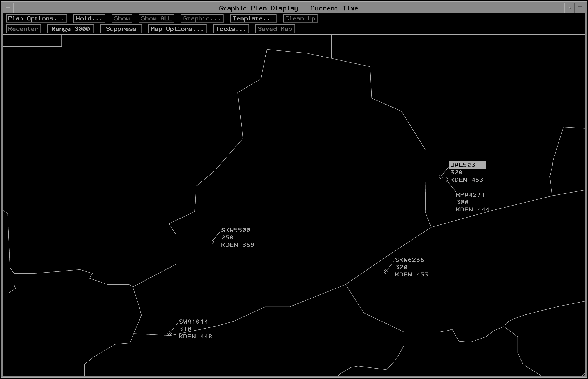
  <figcaption style="text-align: center; font-style: italic;">Fig. 42 - The Graphic Plan Display</figcaption>
</figure>

The Graphic Plan Display (GPD) provides a graphical representation of every entry in the sector's ACL. This display is not a radar display and is instead based on flight plan data and estimations. 

#### GPD Datablocks

Each GPD Datablock is composed of five lines:

- **Line 0**: Active alerts (red, yellow, airspace)
- **Line 1**: Aircraft ID
- **Line 2**: Current and assigned altitude (including block and interim altitudes)
- **Line 3**: Destination and ground speed
- **Line 4**: Flight plan assigned altitude (matches [altitude in ACL](#altitude-column))

#### GPD Menu
The GPD menu contains the following options:

- **Plan Options**: opens the [Plan Options Menu](#plan-options-menu) for the selected flight.
- **Hold**: opens the [Hold Data Menu](#hold-data-menu) for the selected flight.
- **Show**: display or remove an aircraft's path and alerts assigned to your sector.
- **Show All**: display or remove an aircraft's path and all alerts for that path.
- **Graphic**: *Not impelemented*
- **Clean Up**: remove projected route lines for current and trial plans.
- **Recenter**: recenter the GPD on the controller's sector.
- **Range `<range>`**: set the range of the GPD display in nautical miles. This is also adjustable by scrolling when hovering over the GPD display.
- **Suppress**: supress or restore data blocks that are not displaying current trial plan data
- **Map Options**: select which geomaps are displayed on the GPD.
- **Tools**: access the tools menu, which is functionally identical to the [tools menu in the ACL](#toolsoptions-menus).
- **Saved Map**: *Not implemented*

#### Map Options Menu
<figure markdown="block" style="text-align: center;">
  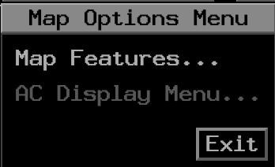
  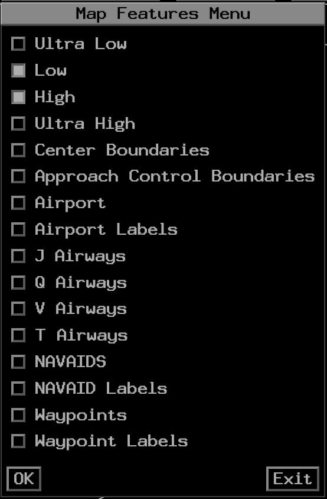
  <figcaption style="text-align: center; font-style: italic;">Fig. 43 - GPD Map Menus</figcaption>
</figure>

The map options menu contains two sections: the map features menu and the AC display menu (not implemented at this time).

The map features menu allows for a set of maps to be enabled/disabled for display on the GPD. The ARTCC boundary map is always-on.

!!!note
    Enabling map display may require support from your FE. More documentation on this will be provided in the future.

### Plans Display
<figure markdown="block" style="text-align: center;">
  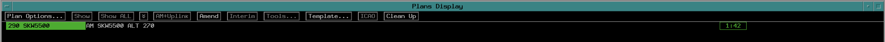
  <figcaption style="text-align: center; font-style: italic;">Fig. 44 - The Plans Display</figcaption>
</figure>

The Plans Display is capable of displaying (on command) the following:

- Flight Plans (invoked from the ACL or GPD)
- Proposed Plans (created from the DL)
- Trial Plans (created from the ACL, DL, GPD, or Plans Display)

!!!note
    At this time the plans display is not fully implemented due to underlying conflict probing and flight plan data limitations. At this time, only the creation of trial plans can trigger the plans display

#### Plans Display Menu
The plans display menu contains the following options:

- **Plan Options**: opens the [Plan Options Menu](#plan-options-menu) for the selected flight.
- **Show**: display or remove the plan on the GPD.
- **Show ALL**: display or remove the plan with all alerts on the GPD.
- **Due to Chevron**: *Not implemented*
- **AM+Uplink**: *Not implemented*
- **Amend**: Executes the given ERAM command shown in the plan entry and suppresses the plan display.
- **Interm**: *Not implemented*
- **Tools**: *Not implemented*
- **Template**: Opens the [Flight Plan Template Menu](#flight-plan-template-menu) with fields pre-populated based on the plan's data.
- **ICAO**: *Not implemented*
- **Clean Up**: remove all trial plans, current plans, and accepted amendment plans and suppress the display.

### Wind Grid Display
<figure markdown="block" style="text-align: center;">
  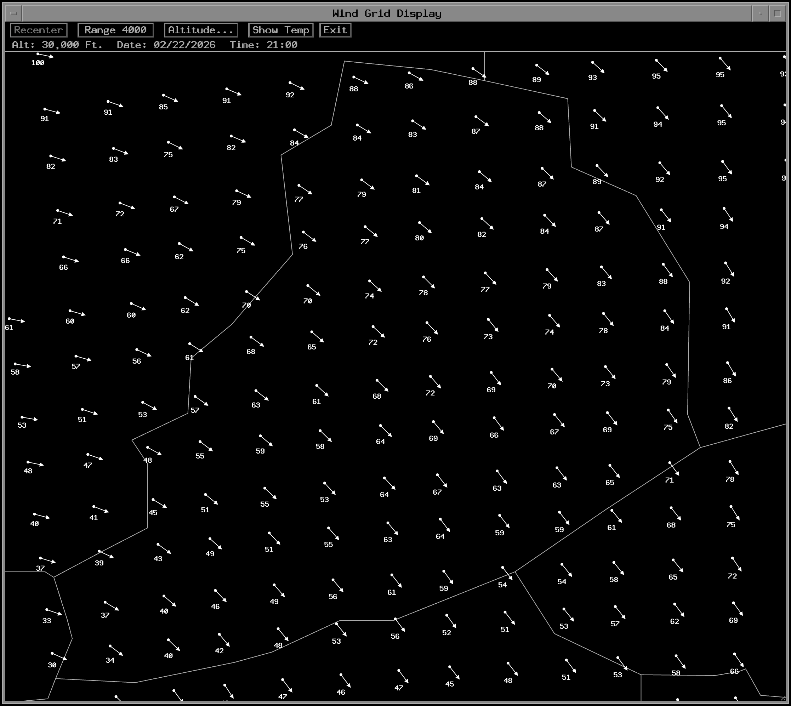
  <figcaption style="text-align: center; font-style: italic;">Fig. 45 - Wind Grid Display</figcaption>
</figure>

The Wind Grid display contains the current wind direction, speed, and temperature across the user's airspace. The display is accessed through the `WIND` toolbar button in the `MORE` section. The display is also suppressed via the `WIND` toolbar button.

The data is retrieved at the top of the hour and processed shortly after. The age of the forecast wind data is displayed in the top bar.

#### Window Manipulation

The wind grid display can be full-screened using the large square button in the top right corner of the display. The display can also be dragged and repositioned by left-clicking and dragging the top bar of the display when not full-screened. The display can be suppressed by clicking the small square button in the top right corner of the display, clicking the `WIND` toolbar button, or by left clicking the `EXIT` button in the display's menu bar.

#### Zooming/Panning

Left clicking the `Range` button zooms in, and right clicking the `Range` button zooms out. The current range (edge to edge in nautical miles) is displayed in the range button. Additionally, users can zoom using the mouse scroll wheel when hovering over the display. Panning is done by left-clicking and dragging anywhere on the display.

#### Altitude Menu
<figure markdown="block" style="text-align: center;">
  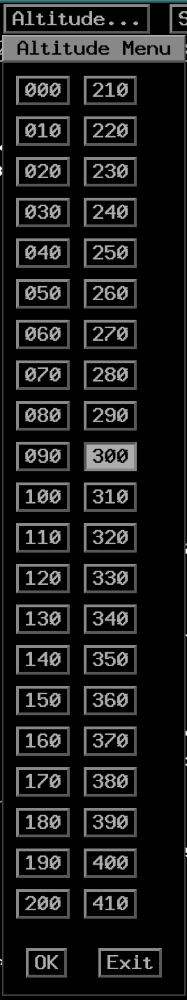
  <figcaption style="text-align: center; font-style: italic;">Fig. 46 - Wind Grid Altitude Menu</figcaption>
</figure>

The `Altitude` button opens a menu allowing for selection of the altitude layer displayed in the wind grid. The default is `FL300`.

#### Temperature Display

The `Show Temp` button toggles the display of temperature data on the wind grid. When enabled, the temperature in Celsius is displayed instead of the wind speed in knots. When displayed, the button changes text to `Remove Temp`.

## Command Reference
!!! note
    All ERAM commands that do **not** require clicking a position on the radar display are supported for entry on the EDST MCA. Please reference the [CRC ERAM Command Reference](https://crc.virtualnas.net/docs/#/eram?id=command-reference) for common ERAM/EDST Commands.

The following commands are specific to EDST UI functionality and do not work in CRC ERAM. These commands are typed into the [MCA](#message-composition-area-view) and executed by pressing `Enter`

| Command                      | Description                                                         |
| ---------------------------- | ------------------------------------------------------------------- |
| `UU <enter>`                 | Displays/Raises the [ACL](#acl-view)                                |
| `UU D <enter>`               | Displays/Raises the [DL](#departure-list-view)                      |
| `UU G <enter>`               | Displays/Raises the [GPD](#graphic-plan-display)                    |
| `UU P <enter>`               | Displays/Raises the [ACL](#acl-view) and toggles Manual Posting     |
| `UU X <enter>`               | All displayed and minimized views are hidden                        |
| `UU <sort criteria> <enter>` | Displays/Raises the [ACL](#acl-view) and changes the sort criteria  |

The following are supported ACL sort criteria:

| Typed Character | Primary Criteria  | Secondary Criteria |
| --------------- | ----------------- | ------------------ |
| `OA`            | ACID              |                    |
| `OD`            | Destination       |                    |
| `OSA`           | Sector/Non-Sector | ACID               |
| `OSD`           | Sector/Non-Sector | Destination        |

## Known Issues
- Many view and display preferences are not currently saved between sessions. Support for saving these preferences will be added in the future.

## Glossary
| Term | Definition |
| ---- | ---------- |
| ACID | Aircraft Identification |
| ACL | Aircraft List |
| ADR | Adapted Departure Route |
| ADAR | Adapted Departure Arrival Route |
| ADS-B | Automatic Dependent Surveillance - Broadcast |
| AOI | Area of Interest |
| APR | ATC Preferred Routes |
| ARTCC | Air Route Traffic Control Center |
| CRC | Consolidated Radar Client |
| DL | Departure List |
| EDST | Enroute Decision Support Tool |
| ERAM | Enroute Automation Modernization |
| FP | Flight Plan |
| GPD | Graphic Plan Display |
| IAFDOF | Incorrect altitude for direction of flight |
| MCA | Message Composition Area |
| METAR | Meteorological Aerodrome Report |
| NOTAM | Notice to Airmen |
| RVSM | Reduced Vertical Separation Minima |
| SIGMET | Significant Meteorological Information |
